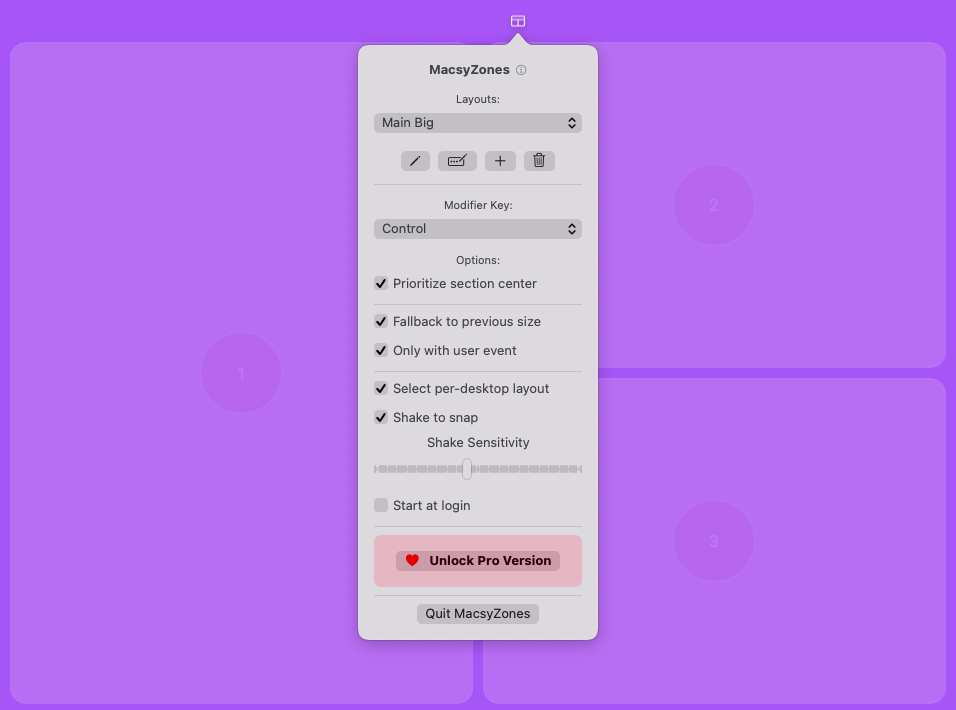

# MacsyZones

Make your workflow more efficient with MacsyZones. Organize your windows with ease.

Visit [https://macsyzones.com](https://macsyzones.com) for more information.

|  | MacsyZones is a FancyZones equivalent for macOS. MacsyZones allows you to create layouts and sections in your layouts as you want and fit your windows into sections with ease. |
| --- | --- |

## Buy to support me

You can buy MacsyZones Pro (the same MacsyZones just "Pro") to support me.

Visit [MacsyZones website](https://macsyzones.com) to buy.

## Donations ❤️

You love [MacsyZones](https://macsyzones.com)? You can support the development by making a donation. You have the following options to donate:

- [Patreon](https://www.patreon.com/evrenselkisilik)
- [GitHub Sponsors](https://github.com/sponsors/rohanrhu)

### Cryptocurrency Donations

| Currency          | Address                                                                                         |
| ----------------- | ----------------------------------------------------------------------------------------------- |
| BTC               | bc1qhvlc762kwuzeawedl9a8z0duhs8449nwwc35e2                                                      |
| ETH / USDT / USDC | 0x1D99B2a2D85C34d478dD8519792e82B18f861974                                                      |
| XMR               | 88qvS4sfUnLZ7nehFrz3PG1pWovvEgprcUhkmVLaiL8PVAFgfHjspjKPLhWLj3DUcm92rwNQENbJ1ZbvESdukWvh3epBUty |

Preferably, donating USDT or USDC is recommended but you can donate any of the above currencies. 🥳

## Contributing

We welcome contributions to MacsyZones. Please see the [CONTRIBUTING.md](CONTRIBUTING.md) file for more information.

## Code of Conduct

We have adopted a Code of Conduct that we expect project participants to adhere to. Please read [CODE_OF_CONDUCT.md](CODE_OF_CONDUCT.md) so that you can understand what actions will and will not be tolerated.

## License

Copyright (C) 2024, Oğuzhan Eroğlu <rohanrhu2@gmail.com> (<https://meowingcat.io/>)

GNU General Public License v3 (GPL-3)

You may copy, distribute and modify the software as long as you track changes/dates in source files. Any modifications to or software including (via compiler) GPL-licensed code must also be made available under the GPL along with build & install instructions.

See [LICENSE](LICENSE) for more information.
